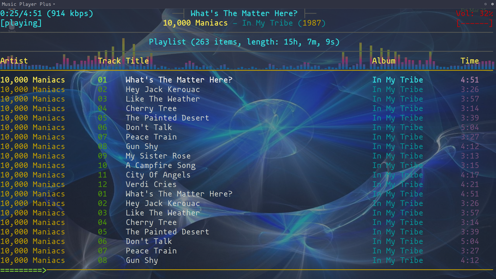

## Mpcplus – featureful NCurses based MPD client

[](https://www.gnu.org/licenses/old-licenses/gpl-2.0.en.html)

The `mpcplus` NCurses MPD client is derived from `ncmpcpp` and customized
for integration with
[MusicPlayerPlus](https://github.com/doctorfree/MusicPlayerPlus).

Many enhancements to `mpcplus` are included in the `MusicPlayerPlus` project.
These include the display of album cover art in a `tmux` session along side
`mpcplus`, the frequency spectrum visualizer `mppcava`, and many more.
The `mpcplus` package gets installed as part of the `MusicPlayerPlus`
initialization process. To enable these enhancements, install
`MusicPlayerPlus` rather than `mpcplus`. See the
[MusicPlayerPlus README](https://github.com/doctorfree/MusicPlayerPlus#readme)
for more information.

**[Note:]** It is possible to install `mpcplus` first, get a feel for it or
simply use it as a standalone MPD client, then install `MusicPlayerPlus` to
add the many enhancements and features available in that package.
The MusicPlayerPlus initialization will detect a previously installed
`mpcplus` and reconfigure it appropriately. Many of the
[Doctorfree projects](https://github.com/doctorfree) are designed to
integrate with each other including
[Asciiville](https://github.com/doctorfree/Asciiville#readme),
[MirrorCommand](https://github.com/doctorfree/MirrorCommand#readme),
[MusicPlayerPlus](https://github.com/doctorfree/MusicPlayerPlus#readme), and
[RoonCommandLine](https://github.com/doctorfree/RoonCommandLine#readme).

## Table of Contents

1. [Main features](#main-features)
1. [Dependencies](#dependencies)
1. [Requirements](#requirements)
1. [Required setup](#required-setup)
1. [Installation](#installation)
1. [Post Installation Configuration](#post-installation-configuration)
1. [Documentation](#documentation)
1. [Removal](#removal)
1. [Screenshots](#screenshots)
1. [Videos](#videos)
1. [Building mpcplus from source](#building-mpcplus-from-source)
1. [Contributing](#contributing)
1. [Known issues](#known-issues)

## Main features

* tag editor
* playlist editor
* easy to use search engine
* media library
* integration with external spectrum visualizer
* ability to fetch song lyrics from a variety of sources
* ability to fetch artist info from last.fm
* new display mode
* alternative user interface
* ability to browse and add files from outside of MPD music directory

…and a lot more minor functions.

## Dependencies

* boost library [https://www.boost.org/]
* ncurses library [http://www.gnu.org/software/ncurses/ncurses.html]
* readline library [https://tiswww.case.edu/php/chet/readline/rltop.html]
* curl library (required for fetching lyrics and last.fm data) [https://curl.haxx.se/]
* fftw library (required for frequency spectrum music visualization mode) [http://www.fftw.org/]
* tag library (required for tag editing) [https://taglib.org/]

All dependencies are automatically installed if not already present.

## Requirements

MusicPlayerPlus is compiled and packaged for installation on:

- Arch Linux (x86_64)
- CentOS Linux (x86_64)
- Fedora Linux (x86_64)
- Raspberry Pi OS (armhf)
- Ubuntu Linux (amd64)

## Required setup

* Install, configure, and activate the Music Player Daemon (MPD)
    * The [MusicPlayerPlus](https://github.com/doctorfree/MusicPlayerPlus) package installs and automatically configures MPD
* Create a music library if you do not already have one
    * Default `mpcplus` location for the music library is `$HOME/Music`
    * Recommended structure of the music library is `artist/album/songs`
* Install the latest Arch, Debian, or RPM format installation package from the [Mpcplus Releases](https://github.com/doctorfree/mpcplus/releases) page
* Run the `mpcinit` command as your normal user

## Installation

Mpcplus v1.0.0 and later can be installed on Linux systems using
the Arch packaging format, the Debian packaging format, or the Red Hat
Package Manager (RPM).

### Supported platforms

Mpcplus has been tested successfully on the following platforms:

- **Arch Linux 2022.07.01**
    - `mpcplus_<version>-<release>-x86_64.pkg.tar.zst`
- **Ubuntu Linux 20.04**
    - `mpcplus_<version>-<release>.amd64.deb`
- **Fedora Linux 36**
    - `mpcplus_<version>-<release>.x86_64.rpm`
- **CentOS Linux 8**
    - `mpcplus_<version>-<release>.x86_64.rpm`
- **Raspbian Linux 11**
    - `mpcplus_<version>-<release>.armhf.deb`

### Debian package installation

Many Linux distributions, most notably Ubuntu and its derivatives, use the
Debian packaging system.

To tell if a Linux system is Debian based it is usually sufficient to
check for the existence of the file `/etc/debian_version` and/or examine the
contents of the file `/etc/os-release`.

To install on a Debian based Linux system, download the latest Debian format
package from the
[mpcplus Releases](https://github.com/doctorfree/mpcplus/releases).

Install the mpcplus package by executing the command

```console
sudo apt install ./mpcplus_<version>-<release>.amd64.deb
```
or
```console
sudo dpkg -i ./mpcplus_<version>-<release>.amd64.deb
```

or, on a Raspberry Pi:

```console
sudo apt install ./mpcplus_<version>-<release>.armhf.deb
```
or
```console
sudo dpkg -i ./mpcplus_<version>-<release>.armhf.deb
```

**NOTE:** In some cases you may see a warning message when installing the
Debian package. The message:

Repository is broken: mpcplus:amd64 (= <version-<release>) has no Size information

can safely be ignored. This is an issue with the Debian packaging system
and has no effect on the installation.

### RPM Package installation

Red Hat Linux, SUSE Linux, and their derivatives use the RPM packaging
format. RPM based Linux distributions include Fedora, AlmaLinux, CentOS,
openSUSE, OpenMandriva, Mandrake Linux, Red Hat Linux, and Oracle Linux.

To install on an RPM based Linux system, download the latest RPM format
package from the
[mpcplus Releases](https://github.com/doctorfree/mpcplus/releases).

Install the mpcplus package by executing the command

```console
sudo yum localinstall ./mpcplus_<version>-<release>.x86_64.rpm
```
or
```console
sudo rpm -i ./mpcplus_<version>-<release>.x86_64.rpm
```

### Arch Package installation

Arch Linux, Manjaro, and other Arch Linux derivatives use the Pacman packaging
format. In addition to Arch Linux, Arch based Linux distributions include
ArchBang, Arch Linux, Artix Linux, ArchLabs, Asahi Linux, BlackArch,
Chakra Linux, EndeavourOS, Frugalware Linux, Garuda Linux,
Hyperbola GNU/Linux-libre, LinHES, Manjaro, Parabola GNU/Linux-libre,
SteamOS, and SystemRescue.

To install on an Arch based Linux system, download the latest Pacman format
package from the
[mpcplus Releases](https://github.com/doctorfree/mpcplus/releases).

Install the mpcplus package by executing the command

```console
sudo pacman -U ./mpcplus_<version>-<release>-x86_64.pkg.tar.zst
```

## Post Installation Configuration

If not already configured, the MPD server will need to know where to
locate your music library. This can be configured by editing the MPD
configuration file `/etc/mpd.conf` or `~/.config/mpd/mpd.conf` and
running the command `mpcinit sync`.

### Client Configuration (required)

Initialize the `mpcplus` client configuration by executing the command:

```
mpcinit
```

Examine the generated `mpcplus` configuration in `~/.config/mpcplus/config`
and `~/.config/mpcplus/bindings` and make any desired changes.

## Documentation

All mpcplus commands have manual pages. Execute `man <command-name>`
to view the manual page for a command.

### Man Pages

- [**mpcinit**](markdown/mpcinit.1.md) : mpcplus initialization
- [**mpcplus**](markdown/mpcplus.1.md) : mpcplus MPD client
- [**mpcpluskeys**](markdown/mpcpluskeys.1.md) : Cheat sheet for `mpcplus` MPD client navigation
- [**artist_to_albumartist**](markdown/artist_to_albumartist.1.md) : Copies the Artist tag to the AlbumArtist tag

### Usage

The `mpc` command provides a quick and easy command line interface
to control the Music Player Daemon playback. The `mpc` command has
many command line options, see `man mpc` for a full description.
To get started with simple MPD playback control using `mpc`:

**mpc toggle**
: start playback if stopped or paused, and pause playback if playing

**mpc stop**
: stop playback

**mpc next**
: move to next song in playlist

**mpc prev**
: move to previous song in playlist

**mpc volume +|- percent**
: increase or decrease volume by 'percent'

The usage messages for `mpcinit` and `mpcplus`
provide a brief summary of the command line options.

The `mpcinit` performs one-time initializations:

```
Usage: mpcinit [-o] [-q] [-r] [-U] [-y] [-u] [mpd|sync]
Where:
	'-o' indicates overwrite any pre-existing configuration
	'-q' indicates quiet execution, no status messages
	'-y' indicates answer 'yes' to all and proceed
	'-u' displays this usage message and exits

	'mpd' activates the MPD music server
	'sync' synchronizes mpcplus configuration across configs

'mpcinit' must be run as the mpcplus user, not root.
```

The `mpcplus` command is an MPD client and acts as the primary
mpcplus music player:

```
Usage: mpcplus [options]...
Options:
  -h [ --host ] HOST (=localhost)       connect to server at host
  -p [ --port ] PORT (=6600)            connect to server at port
  --current-song [=FORMAT(={{{(%l) }{{%a - }%t}}|{%f}})]
                                        print current song using given format 
                                        and exit
  -c [ --config ] PATH (=~/.config/mpcplus/config AND ~/.mpcplus/config)
                                        specify configuration file(s)
  --ignore-config-errors                ignore unknown and invalid options in 
                                        configuration files
  --test-lyrics-fetchers                check if lyrics fetchers work
  -b [ --bindings ] PATH (=~/.config/mpcplus/bindings AND ~/.mpcplus/bindings)
                                        specify bindings file(s)
  -s [ --screen ] SCREEN                specify the startup screen
  -S [ --slave-screen ] SCREEN          specify the startup slave screen
  -? [ --help ]                         show help message
  -v [ --version ]                      display version information
  -q [ --quiet ]                        suppress logs and excess output
```

The mpcplus MPD client has a customized set of key bindings that allow
quick and easy control of MPD, searches, lyrics display, client navigation,
and much more via the keyboard. View the
[**mpcpluskeys man page**](markdown/mpcpluskeys.1.md) with the command
`man mpcpluskeys`.

## Removal

On Debian based Linux systems where the mpcplus package was installed
using the mpcplus Debian format package, remove the mpcplus
package by executing the command:

```console
    sudo apt remove mpcplus
```
or
```console
    sudo dpkg -r mpcplus
```

On RPM based Linux systems where the mpcplus package was installed
using the mpcplus RPM format package, remove the mpcplus
package by executing the command:

```console
    sudo yum remove mpcplus
```
or
```console
    sudo rpm -e mpcplus
```

On Arch based Linux systems where the mpcplus package was installed
using the mpcplus Pacman format package, remove the mpcplus
package by executing the command:

```console
    sudo pacman -Rs mpcplus
```

The mpcplus package can be removed by executing the "Uninstall"
script in the mpcplus source directory:

```console
    git clone https://github.com/doctorfree/mpcplus.git
    cd mpcplus
    ./Uninstall
```

## Screenshots

<p float="left">
  
  
</p>

## Videos

- [](https://www.youtube.com/watch?v=y2yaHm04ELM "Mpcplus Demo")

## Building mpcplus from source

mpcplus can be compiled, packaged, and installed from the source code
repository. This should be done as a normal user with `sudo` privileges:

```
# Retrieve the source code from the repository
git clone https://github.com/doctorfree/mpcplus.git
# Enter the mpcplus source directory
cd mpcplus
# Install the necessary build environment (not necessary on Arch Linux)
scripts/install-dev-env.sh
# Compile the mpcplus components and create an installation package
./mkpkg
# Install mpcplus and its dependencies
./Install
```

These steps are detailed below.

### Clone mpcplus repository

```
git clone https://github.com/doctorfree/mpcplus.git
cd mpcplus
```

**[Note:]** The `mkpkg` script in the top level of the mpcplus
repository can be used to build an installation package on all supported
platforms. After cloning, `cd mpcplus` and `./mkpkg`. The resulting
installation package(s) will be found in `./releases/<version>/`.

### Install build dependencies

mpcplus components have build dependencies on the following:

* libtool
* automake
* build-essentials
* [Boost library](https://www.boost.org/)
* [NCurses library](http://www.gnu.org/software/ncurses/ncurses.html)
* [Readline library](https://tiswww.case.edu/php/chet/readline/rltop.html)
* [Curl library](https://curl.haxx.se/)
* [fftw library](http://www.fftw.org/)
* [tag library](https://taglib.org/)

Install build dependencies via:

```
scripts/install-dev-env.sh
```

**[Note:]** The mpcplus `PKGBUILD` on Arch Linux defines build
dependencies and these will be automatically installed when performing
a `makepkg` build. It is not necessary to pre-install these packages.

### Install packaging dependencies

mpcplus components have packaging dependencies on the following:

On Debian based systems like Ubuntu Linux, install packaging dependencies via:

```
sudo apt install dpkg
```

On RPM based systems like Fedora Linux, install packaging dependencies via:

```
sudo dnf install rpm-build rpm-devel rpmlint rpmdevtools
```

### Build and package mpcplus

To build and package mpcplus, execute the command:

```
./mkpkg
```

On Debian based systems like Ubuntu Linux, the `mkpkg` scripts executes
`scripts/mkdeb.sh`.

On RPM based systems like Fedora Linux, the `mkpkg` scripts executes
`scripts/mkrpm.sh`.

On PKGBUILD based systems like Arch Linux, the `mkpkg` scripts executes
`scripts/mkaur.sh`.

### Install mpcplus from source build

After successfully building and packaging mpcplus with either
`./mkpkg`, install the mpcplus package with the command:

```
./Install
```

## Contributing

There are a variety of ways to contribute to the mpcplus project.
All forms of contribution are appreciated and valuable. Also, it's fun to
collaborate. Here are a few ways to contribute to the further improvement
and evolution of mpcplus:

### Testing and Issue Reporting

mpcplus is fairly complex with many components, features, options,
configurations, and use cases. Although currently only supported on
Linux platforms, there are a plethora of Linux platforms on which
mpcplus can be deployed. Testing all of the above is time consuming
and tedious. If you have a Linux platform on which you can install
mpcplus and you have the time and will to put it through its paces,
then issue reports on problems you encounter would greatly help improve the
robustness and quality of mpcplus. Open issue reports at
[https://github.com/doctorfree/mpcplus/issues](https://github.com/doctorfree/mpcplus/issues)

### Sponsor mpcplus

mpcplus is completely free and open source software. All of the
mpcplus components are freely licensed and may be copied, modified,
and redistributed freely. Nobody gets paid, nobody is making any money,
it's a project fully motivated by curiousity and love of music. However,
it does take some money to procure development and testing resources.
Right now mpcplus needs a multi-boot test platform to extend support
to a wider variety of Linux platforms and potentially Mac OS X.

If you have the means and you would like to sponsor mpcplus development,
testing, platform support, and continued improvement then your monetary
support could play a very critical role. A little bit goes a long way
in mpcplus. For example, a bootable USB SSD device could serve as a 
means of porting and testing support for additional platforms. Or, a
decent cup of coffee could be the difference between a bug filled
release and a glorious musical adventure.

Sponsor the mpcplus project at
[https://github.com/sponsors/doctorfree](https://github.com/sponsors/doctorfree)

### Contribute to Development

If you have programming skills and find the management and ease-of-use of
digital music libraries to be an interesting area, you can contribute to
mpcplus development through the standard Github "fork, clone,
pull request" process. There are many guides to contributing to Github hosted
open source projects on the Internet. A good one is available at
[https://www.dataschool.io/how-to-contribute-on-github/](https://www.dataschool.io/how-to-contribute-on-github/). Another short succinct guide is at
[https://gist.github.com/MarcDiethelm/7303312](https://gist.github.com/MarcDiethelm/7303312).

Once you have forked and cloned the mpcplus repository, it's time to
setup a development environment. Although many of the mpcplus commands
are Bash shell scripts, there are also applicatons written in C and C++ along
with documentation in Markdown format, configuration files in a variety of
formats, examples, screenshots, video demos, build scripts, packaging, and more.

To compile the MPD client `mpcplus` from source, run the command:

```
./build
```

On Debian (e.g. Ubuntu), PKGBUILD (e.g. Arch) and RPM (e.g. Fedora) based
systems the mpcplus installation package can be created with the
`mkpkg` scripts. The `mkpkg` script determines which platform it is on
and executes the appropriate build and packaging script in the `scripts/`
directory. These scripts invoke the build scripts for each of the projects
included with mpcplus, populate a distribution tree, and call the
respective packaging utilities. Packages are saved in the
`./releases/<version>/` folder. Once a package has been created
it can be installed with the `Install` script.

It's not necessary to have C/C++ expertise to contribute to mpcplus
development. Many of the mpcplus commands are Bash scripts and require
no compilaton. Script commands reside in the `bin` and `share/scripts`
directories. To modify a shell script, install mpcplus and edit the
`bin/<script>` or `share/scripts/<script.sh>` you wish to improve.
After making your changes simply copy the revised script to `/usr/bin`
or `/usr/share/mpcplus/scripts` and test your changes.

Feel free to email me at github@ronrecord.com with questions or comments.

## Known issues

* No full support for handling encodings other than UTF-8.

